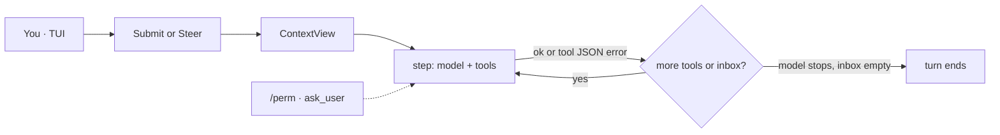

# YunmengZe Agent

本地终端里的编码智能体：失败是观察，TUI 为主。

[English](README.md) | [简体中文](README.zh.md)

[](https://go.dev/)
[](LICENSE)
[](#status)

The open-source **local coding agent** for your terminal. A fail-as-observation harness, a xuan-paper TUI, and typed tools — not a background job runner with a chat bolted on.

> **Alpha** — review config, workspace roots, and permissions before privileged use.  
> **Alpha** — 接触重要数据或高权限凭据前，请先核对配置与权限边界。

## Features

- **Coding loop** — tool failures and non-zero exits come back as JSON observations; the turn continues. Steer mid-turn with Enter. Failures are not a dead run.
- **Agent · Plan · Auto** — Tab cycles **agent** (writes; `/perm` for tests/git) → **plan** (read-only) → **auto** (this session pre-grants process + git).
- **TUI-first** — xuan-paper chrome, live markdown, foldable thinking/tools, native select-to-copy. CLI is for scripts.
- **Your models** — OpenAI / Anthropic / Gemini / OpenAI-compatible. `ymz config import-opencode` maps an existing OpenCode config.
- **Local and bounded** — one daemon, one SQLite `core.db`. Tools only run through the Broker: Policy → Grant → path limits → Audit. No yolo.

## Install

**macOS / Linux** ([Homebrew](https://brew.sh)):

```bash
brew install --cask yyZe0122/tap/ymz
ymz version && ymzd --check
```

**Windows** ([Scoop](https://scoop.sh)):

```powershell
scoop bucket add ymz https://github.com/yyZe0122/scoop-bucket
scoop install ymz
ymz version
```

Taps update on each GitHub Release.

<details>
<summary>Fallback installers and from source</summary>

Pin a release tag with `YMZ_VERSION`, or omit it when a non-prerelease `latest` exists.

**Windows** → `%LOCALAPPDATA%\Programs\YunmengZe\bin` + user PATH:

```powershell
irm "https://raw.githubusercontent.com/yyZe0122/YunmengZe-Agent/main/packaging/scripts/install.ps1" | iex
```

**Linux / macOS** → `~/.local/bin`:

```bash
curl -fsSL "https://raw.githubusercontent.com/yyZe0122/YunmengZe-Agent/main/packaging/scripts/install-user.sh" | sh
export PATH="$HOME/.local/bin:$PATH"
```

Optional: `YMZ_INSTALL_DIR`, `YMZ_REPOSITORY`, `YMZ_VERSION`. Manual zip/tar: put `ymz` / `ymzd` on PATH.

**From source** — Go **1.26+**, pure Go SQLite (`CGO_ENABLED=0`):

```bash
make all && make install    # check + build + ~/.local/bin
```

```powershell
.\scripts\dev.ps1 -Action all
.\scripts\dev.ps1 -Action install
```

Systemd / publish: [`docs/release.md`](docs/release.md).

</details>

## Quick start

```bash
# 1) API key (recommended)
#    edit ~/.yunmengze/env  →  DEEPSEEK1_API_KEY=sk-...
#    or: export DEEPSEEK1_API_KEY=...

# 2) Validate + open TUI (auto-starts the daemon)
ymz config validate --mode user
ymz
```

Leave the TUI with `/quit` — **the daemon keeps running**. Stop it with `ymz stop`.

## Coding loop

One user message is a **turn**. Each model request plus the tools it called is a **step**. Failures feed the model; they do not kill the turn.



| What happened | Loop |
| --- | --- |
| Tool succeeded | JSON in, continue |
| Policy / human deny, or CLI with no wait | `tool_denied` JSON, continue |
| Business failure — missing file, patch miss, non-zero exit, timeout | error JSON, **continue** |
| Unadvertised or invalid tool call | observation JSON, continue |
| Parent context cancelled, or DB cannot persist | cancel / fail the turn |

While a turn is running, **Enter steers the next step** (does not cancel in-flight tools). Esc or `/new` cancels the turn. The model can pause on `ask_user`; CLI and cron never wait.

Packing is a single `ContextView` (prefix + summary + tail + ephemeral todos). Details: [ADR-051](docs/wiki/adr/051-coding-loop-contextview.md) · [ADR-052](docs/wiki/adr/052-coding-loop-harness.md).

## TUI

`ymz` opens the TUI (and starts the daemon if needed). Transcript is bubbles, not a log dump. Live replies stay unfolded and pin to the bottom; thinking and long tool results fold.

| Input | Behavior |
| --- | --- |
| **Tab** · **Shift+Tab** | Cycle **agent** (R/W, `/perm` for tests/git) → **plan** (RO) → **auto** (this session pre-grants process+git) |
| Plain text | Submit. **While a turn is running, Enter steers** |
| `/new` | Leave to ready; cancels a running turn |
| `/perm` | once · similar · permanent · deny |
| `/undo` · **Esc Esc** | Rewind last agent file write |
| `/edit` · `/editundo` | Hide last turn into the editor; `/editundo` rewinds that turn’s files first |
| **Shift+PgUp** / **Shift+PgDn** | Older / newer session |
| `/compact` · `/model` · `/skills` | Context, global/session model, skill preload |
| `/cron` · `/memory` · `/journey` | Jobs, facts, memory+skill timeline |
| **e** / **E** / **c** | Expand last fold · expand all · collapse |
| Drag-select | Copy transcript text |
| **Esc** | Close overlay; running turn → cancel |
| `/quit` | Exit TUI (`/q` `/exit`; daemon stays up) |

`/help` lists the rest. Slash priority: built-in → `chat.commands` → skill id.

VS Code / Cursor: optional TUI launcher (VSIX, not Marketplace). [Install](docs/wiki/vscode.md).

## Configure

Config lives under a **flat home root** (not the project cwd). User mode on every OS: **`~/.yunmengze/`** (`YMZ_HOME` overrides). Windows: `%USERPROFILE%\.yunmengze\`.

```text
~/.yunmengze/
  agent.json          # or agent.local.json (wins)
  env                 # optional KEY=value (does not override process env)
  AGENTS.md           # user rules (seeded if missing)
  core.db
  logs/  run/  skills/
```

Put the API key in `~/.yunmengze/env` or the process environment, then reference `{env:VAR}` in JSON. `{file:path}` and a literal `"apiKey"` (mode `600`, local only) also work.

```json
{
  "model": "deepseek1/deepseek-chat",
  "provider": {
    "deepseek1": {
      "type": "openai-compatible",
      "options": {
        "baseURL": "https://api.deepseek.com/v1",
        "apiKey": "{env:DEEPSEEK1_API_KEY}"
      },
      "models": {
        "deepseek-chat": {
          "name": "DeepSeek Chat"
        }
      }
    }
  }
}
```

- Selection is `providerId/modelId…` (first `/` only; the model segment may contain `/`).
- `maxTokens` = output cap (omit → do not send `max_tokens` except Anthropic); `contextWindow` = packing / UI window. Omit both to fill the window from [models.dev](https://models.dev) (`internal/modelcatalog`; miss → 1M / packing 128k). OpenCode `limit.{context,output}` is accepted.
- Optional `chat` (workspace, tools, permission, memory, slash templates): [`configs/agent.json.example`](configs/agent.json.example).
- User rules: `~/.yunmengze/AGENTS.md`; project `.yunmengze/AGENTS.md` is appended when present. Instruction text only — no grants.
- `ymz config import-opencode` maps OpenCode config → `agent.local.json` (MCP, `chat.commands`, compaction; warns and drops plugins/LSP).

While the daemon is up, edits to `agent.json` / `agent.local.json` / `env` rebuild the **main** provider (~0.5s). `chat.*`, MCP, and role maps need `ymz restart`.

```bash
ymz paths user
ymz config validate --mode user
```

## CLI

Scripts and automation. **No `/perm` wait** — high-risk tools deny immediately.

```bash
ymz run --execution-mode plan "Report workspace status without changing files."
ymz task status|pause|resume|cancel TASK_ID
ymz job list
ymz job create --session SESSION_ID --name NAME --title TITLE --every 1h "objective"
ymz logs --tail 200 --run RUN_ID
ymz start | status | restart | stop
```

Prefer TUI `/cron` to create jobs. Logs: `YMZ_LOG_LEVEL=debug`.

## Architecture

```text
ymz  (TUI · CLI)  ──►  local Gateway  ──►  ymzd
                                            chatsession → harness → Tool Broker
                                            core.db
```

Gateway does not execute tools, call providers, or issue grants. Memory, skills, MCP, and cron jobs are **in-process** on the same daemon — not a product surface of their own.

Design wiki: [`docs/wiki/`](docs/wiki/) (start at [ADR-038](docs/wiki/adr/038-session-chat-boundary.md), [051](docs/wiki/adr/051-coding-loop-contextview.md), [052](docs/wiki/adr/052-coding-loop-harness.md)). Catalog: [`docs/README.md`](docs/README.md).

## Development

```bash
make format && make check && make build
go test ./... -count=1
```

```powershell
.\scripts\dev.ps1 -Action format
.\scripts\dev.ps1 -Action check
```

See [`CONTRIBUTING.md`](CONTRIBUTING.md), [`AGENTS.md`](AGENTS.md). Vulns: [`SECURITY.md`](SECURITY.md).

## Security

- Do not commit secrets, `agent.local.json`, `*.db`, logs, sockets, or `bin/` / `dist/`.
- Least privilege: workspace roots, `chat.tools` / `chat.permission.allow`, service accounts.
- Grants and the Tool Broker are security boundaries, not optional UI. There is no yolo flag.
- Back up `core.db` before upgrades on important installs.
- Review remote install scripts before piping to a shell.

Details: [`SECURITY.md`](SECURITY.md), [threat model ADR-008](docs/wiki/adr/008-threat-model.md).

## License

[Apache License 2.0](LICENSE). Contributions under the same terms.

## Status

Alpha. Focus is the **coding loop and TUI**. Cron, MCP, and memory are supporting pieces — not the headline.

Current line: **v0.3.1** (coding-loop harness + Tab Auto + product README). Optional tails (compat API, messaging channels) live in [`docs/backlog/current.md`](docs/backlog/current.md).

Release checklist: [`docs/release.md`](docs/release.md).
