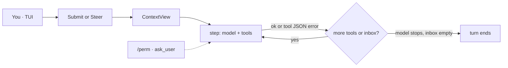

# YunmengZe Agent

A local coding agent for your terminal. Failures are observations. Enter steers. The TUI is the product.

[English](README.md) | [简体中文](README.zh.md)

[](https://go.dev/)
[](LICENSE)
[](#status)

You ask an agent to write code. Mid-turn a test goes red.
The run dies. The thought is gone. The error is dumped in your lap.

Or you watch it edit the wrong file and cannot interrupt without throwing the turn away.

An agent should not be that brittle. It should not run away with the wheel.

**YunmengZe** is a local coding agent. Failures come back as facts. You can correct course without killing the turn. Side effects go through one audited gate. This is not a job runner with a chat bolted on.

> **Alpha** — review config, workspace roots, and permissions before privileged use.

## How it works with you

**A failure is not a dead run.** Compile errors, red tests, non-zero exits — elsewhere that often kills the turn. Here they become structured observations. The model reads them and keeps going.

**You can steer while it runs.** If the approach is wrong, do not wait it out and do not `Ctrl+C` the whole turn. Hit Enter, add a sentence, and the next step follows you. In-flight tools are not cancelled by that Enter.

**The screen is paper, not a log dump.** Transcript is bubbles. Live replies stay open at the bottom; thinking and long tool output fold. Select-to-copy is native. `/edit` retracts a turn; a bad `fs_remove` is `/undo`.

**Local, bounded, stoppable.** One Go binary. One SQLite `core.db`. File writes and processes go Policy → grant → path limits → audit. There is no yolo. Tab cycles **agent** (writes; tests/git ask you) → **plan** (read-only) → **auto** (this session pre-grants process + git).

Bring OpenAI, Anthropic, Gemini, or any OpenAI-compatible endpoint. Omit the window and it fills from [models.dev](https://models.dev). Already on OpenCode? `ymz config import-opencode`.

| | Typical coding agent | YunmengZe |
| --- | --- | --- |
| Errors, non-zero exits | Turn dies, context breaks | Error feeds the model; the turn continues |
| Wrong direction mid-run | Wait it out, or kill and restart | Enter steers the next step |
| Permissions | Prompt fatigue, or fully open | Tab: write / read-only / this-session grant |
| Context window | Manual docs, easy to clip | Optional; models.dev fills it |
| Local shape | Extra processes, containers, stray state | One binary, one database |
| OpenCode | A second config world | Import, then fill workspace and grants |

## Install

**macOS / Linux** ([Homebrew](https://brew.sh)):

```bash
brew install --cask yyZe0122/tap/ymz
ymz version && ymzd --check
```

**Windows** ([Scoop](https://scoop.sh)):

```powershell
scoop bucket add ymz https://github.com/yyZe0122/scoop-bucket
scoop install ymz
ymz version
```

Taps update on each GitHub Release.

<details>
<summary>Fallback installers and from source</summary>

Pin a release tag with `YMZ_VERSION`, or omit it when a non-prerelease `latest` exists.

**Windows** → `%LOCALAPPDATA%\Programs\YunmengZe\bin` + user PATH:

```powershell
irm "https://raw.githubusercontent.com/yyZe0122/YunmengZe-Agent/main/packaging/scripts/install.ps1" | iex
```

**Linux / macOS** → `~/.local/bin`:

```bash
curl -fsSL "https://raw.githubusercontent.com/yyZe0122/YunmengZe-Agent/main/packaging/scripts/install-user.sh" | sh
export PATH="$HOME/.local/bin:$PATH"
```

Optional: `YMZ_INSTALL_DIR`, `YMZ_REPOSITORY`, `YMZ_VERSION`. Manual zip/tar: put `ymz` / `ymzd` on PATH.

**From source** — Go **1.26+**, pure Go SQLite (`CGO_ENABLED=0`):

```bash
make all && make install    # check + build + ~/.local/bin
```

```powershell
.\scripts\dev.ps1 -Action all
.\scripts\dev.ps1 -Action install
```

Systemd / publish: [`docs/release.md`](docs/release.md).

</details>

## Quick start

```bash
# 1) API key (recommended: local file, never committed)
#    edit ~/.yunmengze/env  →  DEEPSEEK1_API_KEY=sk-...
#    or: export DEEPSEEK1_API_KEY=...

# 2) Validate + open TUI (auto-starts the daemon)
ymz config validate --mode user
ymz
```

Leave the TUI with `/quit` — **the daemon keeps running**. Stop it with `ymz stop`.

## Coding loop

One user message is a **turn**. Each model request plus the tools it called is a **step**. Failures feed the model; they do not kill the turn.



| What happened | Loop |
| --- | --- |
| Tool succeeded | JSON in, continue |
| Policy / human deny, or CLI with no wait | `tool_denied` JSON, continue |
| Business failure — missing file, patch miss, non-zero exit, timeout | error JSON, **continue** |
| Unadvertised or invalid tool call | observation JSON, continue |
| Parent context cancelled, or DB cannot persist | cancel / fail the turn |

While a turn is running, **Enter steers the next step** (does not cancel in-flight tools). Esc or `/new` cancels the turn. The model can pause on `ask_user` (question card: numbered options, Type your own answer, multi-question ←→). CLI and cron never wait. Permission/question cards take Enter until decided or Esc Esc dismiss.

Packing is a single `ContextView` (prefix + summary + tail + ephemeral todos). Details: [ADR-051](docs/wiki/adr/051-coding-loop-contextview.md) · [ADR-052](docs/wiki/adr/052-coding-loop-harness.md).

Sub-agents use `task` with `kind` `general` / `explore` / `web` (`vision` / `speech` / `video` only when those roles are configured). Children are leaves; grants never expand. Pass the previous `task_id` to continue the same child; omit to start a new one. Web search defaults to DuckDuckGo; SearXNG / Tavily are optional. Plan and cron never get those tools.

## TUI

`ymz` opens the TUI (and starts the daemon if needed).

| Input | Behavior |
| --- | --- |
| **Tab** · **Shift+Tab** | Cycle **agent** (R/W, `/perm` for tests/git) → **plan** (RO) → **auto** (this session pre-grants process+git) |
| **Ctrl+P** / **L** / **S** / **T** | Command · model · session palettes; todo pills |
| Plain text | Submit. **While a turn is running, Enter steers** |
| `/new` | Leave to ready; cancels a running turn |
| `/perm` | Permission card: once · similar · permanent · deny. Extra-root absolute paths use the same four tiers. Esc Esc (3s) dismisses. |
| `/undo` · **Esc Esc** | Rewind last agent file write |
| `/edit` · `/editundo` | Hide last turn into the editor; `/editundo` rewinds that turn’s files first |
| **Shift+PgUp** / **Shift+PgDn** | Older / newer session |
| `/compact` · `/model` · `/skills` | Context, this-session model (`/model main` = global), skill preload |
| `/cron` · `/memory` · `/journey` | Jobs, facts, memory+skill timeline |
| **e** / **E** / **c** | Expand last fold · expand all · collapse |
| Drag-select | Copy transcript text |
| **Esc** | Close overlay; permission/question cards need Esc Esc (3s); running turn → cancel |
| `/quit` | Exit TUI (`/q` `/exit`; daemon stays up) |

`/help` lists the rest. Slash priority: built-in → `chat.commands` → skill id.

VS Code / Cursor: optional TUI launcher (VSIX, not Marketplace). [Install](docs/wiki/vscode.md).

## Configure

Config lives under a **flat home root** (not the project cwd). User mode on every OS: **`~/.yunmengze/`** (`YMZ_HOME` overrides). Windows: `%USERPROFILE%\.yunmengze\`.

```text
~/.yunmengze/
  agent.json          # or agent.local.json (wins; whole-file replace)
  env                 # optional KEY=value (does not override process env)
  AGENTS.md           # user rules (seeded if missing)
  core.db
  logs/  run/  skills/
```

Put the API key in `~/.yunmengze/env` or the process environment, then reference `{env:VAR}` in JSON. `{file:path}` and a literal `"apiKey"` (mode `600`, local only) also work.

First start seeds **only** `model`, `models.subagent` / `compact` pointing at the same ref, and two DeepSeek-style providers. Omit `chat` / `mcp` to keep runtime defaults (agent may write; git/process off; compaction/memory on; web = DuckDuckGo; no step cap).

```json
{
  "model": "deepseek1/deepseek-chat",
  "models": {
    "subagent": "deepseek1/deepseek-chat",
    "compact": "deepseek1/deepseek-chat"
  },
  "provider": {
    "deepseek1": {
      "type": "openai-compatible",
      "options": {
        "baseURL": "https://api.deepseek.com/v1",
        "apiKey": "{env:DEEPSEEK1_API_KEY}"
      },
      "models": {
        "deepseek-chat": { "name": "DeepSeek Chat" }
      }
    }
  }
}
```

Selection is `providerId/modelId…` (first `/` only; the model segment may contain `/`). `maxTokens` is the output cap; `contextWindow` is the packing window. Omit both to fill from [models.dev](https://models.dev) (miss → 1M / packing 128k). OpenCode `limit.{context,output}` is accepted.

`agent.local.json` **replaces** `agent.json` (not a merge). Project cwd is not searched for JSON; only `.yunmengze/AGENTS.md` and skills append from the project. Full example + JSON Schema: [`configs/agent.json.example`](configs/agent.json.example) · [`configs/agent.schema.json`](configs/agent.schema.json). Wire fields: [`docs/wiki/provider-protocols.md`](docs/wiki/provider-protocols.md).

| Key | Default if omitted | Hot-reload? |
| --- | --- | --- |
| `model` | required | yes (main stack) |
| `models.subagent` / `compact` / `web` | top-level `model` (`web` → subagent then main) | **no** — `ymz restart` |
| `models.vision` / `speech` | tools not advertised | **no** |
| `provider.<id>` | required catalog | yes (main: URL / key / protocol / window) |
| `chat.workspace` | session root = client cwd; `allow_all=false` | **no** (permanent `/perm` extra-root writes `allow` in-memory) |
| `chat.allow_write` | `true` (plan is always RO) | **no** |
| `chat.tools.git` / `process` | `false` (OR `chat.permission.allow`) | **no** |
| `chat.permission.mode` | ignored at runtime | — |
| `chat.compaction.enabled` | `true` | **no** |
| `chat.max_iterations` | `0` = no hard cap | **no** |
| `chat.memory` | on; inject 2000 runes; curator on | **no** |
| `chat.skills.unused_ttl` | off | **no** |
| `chat.commands` | none (`/<id>` → user message only) | **no** |
| `chat.web.search` | `ddg` (`searxng` needs `searxng_url`; `tavily` needs `tavily_key`) | **no** |
| `mcp.servers` | none | **no** |

Do not set `models.main` or `models.video`. [ADR-045](docs/wiki/adr/045-model-roles.md) · [ADR-055](docs/wiki/adr/055-auxiliary-media-boundary.md).

### Import from OpenCode

```bash
ymz config import-opencode [path] [--dry-run] [--mode user|system] [--output path]
```

No path → `~/.config/opencode/opencode.json` then `~/.opencode/`. Writes **`~/.yunmengze/agent.local.json`** (`0600`). Then `ymz config validate` and `ymz restart`.

| OpenCode | YunmengZe |
| --- | --- |
| `model`, `provider.*` | same nested catalog; `npm` → `type`; `options.baseURL` / `apiKey` / `headers` kept |
| `models.subagent` / `compact` / `web` / `vision` / `speech` | top-level `models` role map |
| `mcp` | `mcp.servers` (stdio `command` or remote `url`) |
| `command` | `chat.commands` (`template` / `prompt` / `message`) |
| `compaction.auto` / `enabled` | `chat.compaction.enabled` |

**Dropped with warnings:** plugins, LSP, theme/keybinds/tui, agent/mode maps, top-level `permission`/`tools`, `small_model`, MCP oauth, `models.main` / unknown roles. Hand-fill after import: `chat.workspace`, `chat.tools` / `permission.allow`, extra roles. YMZ does **not** merge global + project OpenCode files — pass the file you want.

While the daemon is up, edits to `agent.json` / `agent.local.json` / `env` rebuild the **main** provider (~0.5s). `chat.*`, MCP, and role maps need `ymz restart`.

```bash
ymz paths user
ymz config validate --mode user
```

## CLI

Scripts and automation. **No `/perm` wait** — high-risk tools deny immediately.

```bash
ymz run --execution-mode plan "Report workspace status without changing files."
ymz task status|pause|resume|cancel TASK_ID
ymz job list
ymz job create --session SESSION_ID --name NAME --title TITLE --every 1h "objective"
ymz logs --tail 200 --run RUN_ID
ymz start | status | restart | stop
```

Prefer TUI `/cron` to create jobs. Logs: `YMZ_LOG_LEVEL=debug`.

## Shape

```text
ymz  (TUI · CLI)  ──►  local Gateway  ──►  ymzd
                                            chatsession → harness → Tool Broker
                                            core.db
```

Gateway does not execute tools, call providers, or issue grants. Memory, skills, MCP, and cron jobs are **in-process** on the same daemon — not a product surface of their own.

Design wiki: [`docs/wiki/`](docs/wiki/). Catalog: [`docs/README.md`](docs/README.md).

## Development

```bash
make format && make check && make build
go test ./... -count=1
```

```powershell
.\scripts\dev.ps1 -Action format
.\scripts\dev.ps1 -Action check
```

See [`CONTRIBUTING.md`](CONTRIBUTING.md), [`AGENTS.md`](AGENTS.md). Vulns: [`SECURITY.md`](SECURITY.md).

## Security

- Do not commit secrets, `agent.local.json`, `*.db`, logs, sockets, or `bin/` / `dist/`.
- Least privilege: workspace roots, `chat.tools` / `chat.permission.allow`, service accounts.
- Grants and the Tool Broker are security boundaries, not optional UI. There is no yolo flag.
- Back up `core.db` before upgrades on important installs.
- Review remote install scripts before piping to a shell.

Details: [`SECURITY.md`](SECURITY.md), [threat model ADR-008](docs/wiki/adr/008-threat-model.md).

## License

[Apache License 2.0](LICENSE). Contributions under the same terms.

## Status

Alpha. Focus is the **coding loop and TUI**. Cron, MCP, and memory are supporting pieces — not the headline.

Current line: **v0.6.0**. Optional tails live in [`docs/backlog/current.md`](docs/backlog/current.md). Release checklist: [`docs/release.md`](docs/release.md).
