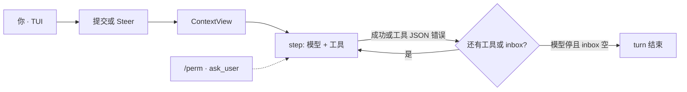

# YunmengZe Agent

本地终端里的编码智能体：失败是观察，TUI 为主。

[English](README.md) | [简体中文](README.zh.md)

[](https://go.dev/)
[](LICENSE)
[](#status)

开源的**本机编码智能体**。失败回灌的 harness、清宣纸 TUI、类型化工具 —— 不是把聊天贴在后台任务上。

> **Alpha** — 接触重要数据或高权限凭据前，请先核对配置、工作区根与权限边界。

安装命令与完整 JSON 示例见 [英文 README](README.md)。下面是同一份产品说明。

## 特性

- **编码循环** — 工具失败、非零退出以 JSON 观察回灌，turn 继续。运行中回车 steer 下一步。失败不是整轮死亡。
- **Agent · Plan · Auto** — Tab 循环 **agent**（可写；测试/git 走 `/perm`）→ **plan**（只读）→ **auto**（本 session 预授 process + git）。
- **模型会自己补窗** — OpenAI / Anthropic / Gemini / OpenAI 兼容。省略 `contextWindow` / `maxTokens` 时从 [models.dev](https://models.dev) 填窗。`ymz config import-opencode` 可映射已有 OpenCode 配置。
- **类型化子代理** — `task.kind`：`general` / `explore` / `web`；配了 `models.vision` / `models.speech` 才有 vision / speech / video。子永远叶子，授权不扩大。
- **网页** — 交互 agent 的 `web_search` / `web_extract`（`/perm`，similar = host）。默认 DuckDuckGo，可选 SearXNG / Tavily（`chat.web`）。plan / cron 不广告。
- **可选媒体** — 配了 `models.vision` / `models.speech` 才广告 `vision_analyze` · `audio_transcribe` · `video_analyze`。主循环仍是文本。
- **TUI 为主，IDE 可选** — 清宣纸 chrome、live markdown、可折叠 thinking/工具、终端原生划选复制。`/edit` 撤回一轮；`fs_remove` 可 `/undo`。可选 VS Code / Cursor 终端启动器（VSIX，不上 Marketplace）。CLI 给脚本。
- **本机、有界** — 一个 daemon、一份 SQLite `core.db`。副作用只经 Tool Broker：Policy → Grant → 路径限制 → Audit。没有 yolo。

## 安装

**macOS / Linux**（[Homebrew](https://brew.sh)）：

```bash
brew install --cask yyZe0122/tap/ymz
ymz version && ymzd --check
```

**Windows**（[Scoop](https://scoop.sh)）：

```powershell
scoop bucket add ymz https://github.com/yyZe0122/scoop-bucket
scoop install ymz
ymz version
```

每个 GitHub Release 会更新 tap。脚本安装器与源码编译见 [英文 README · Install](README.md#install)。

## 快速开始

```bash
# 1) API key（推荐）
#    编辑 ~/.yunmengze/env  →  DEEPSEEK1_API_KEY=sk-...
#    或: export DEEPSEEK1_API_KEY=...

# 2) 校验并打开 TUI（会自动拉起 daemon）
ymz config validate --mode user
ymz
```

`/quit` 只退出 TUI，**daemon 继续跑**。真正停掉用 `ymz stop`。

## 编码循环

一次用户消息是一个 **turn**。一次模型请求加上它点的工具是一个 **step**。失败喂给模型，不掐死本轮。



| 发生了什么 | 循环 |
| --- | --- |
| 工具成功 | JSON 回灌，继续 |
| 策略 / 人 deny，或 CLI 无 wait | `tool_denied` JSON，继续 |
| 业务失败 — 缺文件、补丁未命中、非零退出、超时 | 错误 JSON，**继续** |
| 未广告或非法 tool call | 观察 JSON，继续 |
| 父 ctx 取消，或 DB 无法落盘 | 取消 / 失败本 turn |

运行中 **回车 = steer 下一步**（不取消正在执行的工具）。Esc 或 `/new` 取消本轮。模型可停在 `ask_user`（问题卡：编号选项、Type your own answer、多题 ←→）。CLI 和 cron 永不等待。提问/授权卡开着时 Enter 不 steer，Esc Esc（3s）撤销。

装配是一次 `ContextView`（Prefix + Summary + Tail + 每轮 todos）。细节：[ADR-051](docs/wiki/adr/051-coding-loop-contextview.md) · [ADR-052](docs/wiki/adr/052-coding-loop-harness.md)。

## TUI

`ymz` 打开 TUI（必要时拉起 daemon）。时间线是气泡，不是日志堆。Live 回复不折叠、吸底；thinking 和长工具结果可折。

| 输入 | 行为 |
| --- | --- |
| **Tab** · **Shift+Tab** | 循环 **agent**（可写，测试/git 走 `/perm`）→ **plan**（只读）→ **auto**（本 session 预授 process+git） |
| **Ctrl+P** / **L** / **S** / **T** | 命令盘 · 模型盘 · 会话盘 · todos pills |
| 普通文字 | 提交。**运行中回车 = steer** |
| `/new` | 离焦到 ready；运行中则取消本轮 |
| `/perm` | 授权卡：once · similar · permanent · deny。工作区外绝对路径同一四档。Esc Esc（3s）撤销。 |
| `/undo` · **Esc Esc** | 撤回上次 agent 写文件 |
| `/edit` · `/editundo` | 隐藏上一轮并填入编辑器；`/editundo` 先撤回该轮文件 |
| **Shift+PgUp** / **Shift+PgDn** | 更旧 / 更新会话 |
| `/compact` · `/model` · `/skills` | 压缩上下文、全局/会话模型、预载技能 |
| `/cron` · `/memory` · `/journey` | 定时任务、记忆、记忆+技能时间线 |
| **e** / **E** / **c** | 展开上一折 · 全开 · 收起 |
| 划选 | 复制 transcript |
| **Esc** | 关 overlay；提问/授权卡需 Esc Esc（3s）撤销；运行中则取消 turn |
| `/quit` | 退出 TUI（`/q` `/exit`；daemon 仍在） |

其余见 `/help`。斜杠优先级：内置 → `chat.commands` → skill id。

VS Code / Cursor：可选 TUI 启动器（VSIX，不上 Marketplace）。[安装说明](docs/wiki/vscode.md)。

## 配置

配置在**扁平家目录**（不是项目 cwd）。所有 OS 的 user 模式：**`~/.yunmengze/`**（`YMZ_HOME` 可覆盖）。Windows：`%USERPROFILE%\.yunmengze\`。

```text
~/.yunmengze/
  agent.json          # 或 agent.local.json（优先）
  env                 # 可选 KEY=value（不覆盖进程环境）
  AGENTS.md           # 用户规则（缺失时种子）
  core.db
  logs/  run/  skills/
```

API key 放 `~/.yunmengze/env` 或进程环境，JSON 里写 `{env:VAR}`。也支持 `{file:path}` 和字面 `"apiKey"`（仅本机，权限 `600`）。

最小示意见 [英文 README · Configure](README.md#configure)。完整 `chat` / MCP / 角色映射：[`configs/agent.json.example`](configs/agent.json.example)。

- 选型：`providerId/modelId…`（只切第一道 `/`；模型段可以再含 `/`）。
- `maxTokens` = 输出帽（省略则除 Anthropic 外不发 `max_tokens`）；`contextWindow` = 装配 / UI 窗。都省略时从 [models.dev](https://models.dev) 填窗（未命中 → 1M / packing 128k）。也接受 OpenCode 的 `limit.{context,output}`。
- 可选角色映射与网页检索（改 `models.*` 或 `chat.*` 需 `ymz restart`）：`models.subagent` / `compact` / `web`。省略某角色 → 该路径用顶层 `model`。首次 `EnsureConfig` 会写入指向 main 的 `subagent` + `compact`。配了 `models.vision` / `speech` 才广告看图 / 转写 / 抽帧。不要设 `models.main` 或 `models.video`。[ADR-045](docs/wiki/adr/045-model-roles.md) · [ADR-055](docs/wiki/adr/055-auxiliary-media-boundary.md)。`chat.web.search` 默认 `ddg`。
- 用户规则：`~/.yunmengze/AGENTS.md`；项目 `.yunmengze/AGENTS.md` 存在则追加。只是指令，不扩授权。
- `ymz config import-opencode` 把 OpenCode 配置映到 `agent.local.json`。

daemon 在跑时，改 `agent.json` / `agent.local.json` / `env` 会重建 **main** provider（约 0.5s）。`chat.*`、MCP、角色映射需要 `ymz restart`。

```bash
ymz paths user
ymz config validate --mode user
```

## CLI

给脚本。**没有 `/perm` 等待** — 高风险工具立刻 deny。

```bash
ymz run --execution-mode plan "Report workspace status without changing files."
ymz task status|pause|resume|cancel TASK_ID
ymz job list
ymz logs --tail 200 --run RUN_ID
ymz start | status | restart | stop
```

建定时任务优先用 TUI `/cron`。日志：`YMZ_LOG_LEVEL=debug`。

## 架构

```text
ymz  (TUI · CLI)  ──►  本地 Gateway  ──►  ymzd
                                           chatsession → harness → Tool Broker
                                           core.db
```

Gateway 不执行工具、不调模型、不发 grant。记忆、技能、MCP、cron 都在**同一进程**里 —— 不是独立产品面。

设计 wiki：[`docs/wiki/`](docs/wiki/)（从 [ADR-038](docs/wiki/adr/038-session-chat-boundary.md)、[039](docs/wiki/adr/039-logical-child-runs.md)、[051](docs/wiki/adr/051-coding-loop-contextview.md)、[052](docs/wiki/adr/052-coding-loop-harness.md)、[055](docs/wiki/adr/055-auxiliary-media-boundary.md) 开始）。目录：[`docs/README.md`](docs/README.md)。

## 开发

```bash
make format && make check && make build
go test ./... -count=1
```

见 [`CONTRIBUTING.md`](CONTRIBUTING.md)、[`AGENTS.md`](AGENTS.md)。漏洞：[`SECURITY.md`](SECURITY.md)。

## 安全

- 不要提交密钥、`agent.local.json`、`*.db`、日志、socket、`bin/` / `dist/`。
- 最小权限：工作区根、`chat.tools` / `chat.permission.allow`、服务账号。
- Grant 与 Tool Broker 是安全边界，不是可选 UI。没有 yolo。
- 重要安装升级前备份 `core.db`。
- 管道执行远程安装脚本前先读内容。

细节：[`SECURITY.md`](SECURITY.md)，[威胁模型 ADR-008](docs/wiki/adr/008-threat-model.md)。

## 许可

[Apache License 2.0](LICENSE)。贡献按相同条款。

## 状态

Alpha。焦点是**编码循环和 TUI**。Cron、MCP、记忆是支撑，不是主卖点。

当前线：**v0.5.0**（类型化子代理 + 网页检索 + 可选媒体 + models.dev 填窗）。可选尾巴（compat API、消息通道）见 [`docs/backlog/current.md`](docs/backlog/current.md)。
