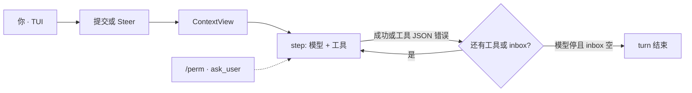

# 云梦泽 · YunmengZe Agent

本地终端里的编码智能体。失败是观察，回车即纠偏，TUI 为主。

[English](README.md) | [简体中文](README.zh.md)

[](https://go.dev/)
[](LICENSE)
[](#status)

让 AI 写代码，写到一半测试红了。
上一秒还在想，下一秒整轮没了。错误甩回你脸上，上下文跟着断掉。

或者你看着它改偏了文件，只能等它把错路走完，或者 `Ctrl+C` 推倒重来。

智能体不该这么脆，也不该脱缰。

**云梦泽**是跑在你本机终端里的编码智能体。它把失败当成下一组事实，把方向盘留在你手里，把副作用关进一条可审计的门。不是把聊天贴在后台任务上。

> **Alpha** — 接触重要数据或高权限凭据前，请先核对配置、工作区根与权限边界。

## 它怎么跟你共事

**失败继续跑。** 编译挂了、测试红了、命令非零退出——在别处常常是整轮死亡。这里错误变成结构化观察，模型当场读、当场改，当前这一轮继续。

**跑着也能改口。** 看着它写歪了，不必打断清空。运行中回车补一句，下一步就按新方向走。正在执行的工具不会被这一下掐掉。

**屏幕是宣纸，不是日志堆。** 对话是气泡。正在生成的回复吸底展开；思考和长工具输出默认折起来。终端里划选就能复制。`/edit` 收回上一轮；误删的文件可以 `/undo`。

**本机、有界、可停。** 一个 Go 二进制，一份 SQLite `core.db`。改文件、跑进程，一律经过 Policy → 授权 → 路径限制 → 审计。没有 yolo。Tab 在 **agent**（可写，测试/git 问你）→ **plan**（只读）→ **auto**（本会话预授 process + git）之间切换。

OpenAI / Anthropic / Gemini / OpenAI 兼容都可以。窗口没填时从 [models.dev](https://models.dev) 补。已有 OpenCode 配置可以用 `ymz config import-opencode` 迁过来。

| | 常见编码智能体 | 云梦泽 |
| --- | --- | --- |
| 报错、非零退出 | 整轮中断，上下文断裂 | 错误回灌，本轮继续修 |
| 写歪了 | 等它跑完，或强行打断重来 | 运行中回车纠偏 |
| 权限 | 一路弹窗，或全放行 | Tab：写 / 只读 / 本会话提权 |
| 上下文窗口 | 自己查文档、漏配就截断 | 可省略，models.dev 补窗 |
| 本机形态 | 多进程、容器、状态散落 | 单二进制 + 单库 |
| OpenCode | 另起一套配置 | 一键导入，再手补工作区与权限 |

## 安装

**macOS / Linux**（[Homebrew](https://brew.sh)）：

```bash
brew install --cask yyZe0122/tap/ymz
ymz version && ymzd --check
```

**Windows**（[Scoop](https://scoop.sh)）：

```powershell
scoop bucket add ymz https://github.com/yyZe0122/scoop-bucket
scoop install ymz
ymz version
```

每个 GitHub Release 会更新 tap。

<details>
<summary>脚本安装与源码编译</summary>

用 `YMZ_VERSION` 钉某个 tag；已有正式 `latest` 时可省略。

**Windows** → `%LOCALAPPDATA%\Programs\YunmengZe\bin` + 用户 PATH：

```powershell
irm "https://raw.githubusercontent.com/yyZe0122/YunmengZe-Agent/main/packaging/scripts/install.ps1" | iex
```

**Linux / macOS** → `~/.local/bin`：

```bash
curl -fsSL "https://raw.githubusercontent.com/yyZe0122/YunmengZe-Agent/main/packaging/scripts/install-user.sh" | sh
export PATH="$HOME/.local/bin:$PATH"
```

可选：`YMZ_INSTALL_DIR`、`YMZ_REPOSITORY`、`YMZ_VERSION`。手动 zip/tar：把 `ymz` / `ymzd` 放进 PATH。

**从源码** — Go **1.26+**，纯 Go SQLite（`CGO_ENABLED=0`）：

```bash
make all && make install    # check + build + ~/.local/bin
```

```powershell
.\scripts\dev.ps1 -Action all
.\scripts\dev.ps1 -Action install
```

systemd / 发版：[`docs/release.md`](docs/release.md)。

</details>

## 三步开始

```bash
# 1) API key（推荐写进本地文件，不进仓库）
#    编辑 ~/.yunmengze/env  →  DEEPSEEK1_API_KEY=sk-...
#    或: export DEEPSEEK1_API_KEY=...

# 2) 校验并打开 TUI（会自动拉起 daemon）
ymz config validate --mode user
ymz
```

`/quit` 只退出界面，**daemon 继续跑**。真正停掉用 `ymz stop`。

## 编码循环

一次用户消息是一个 **turn**。一次模型请求加上它点的工具是一个 **step**。失败喂给模型，不掐死本轮。



| 发生了什么 | 循环 |
| --- | --- |
| 工具成功 | JSON 回灌，继续 |
| 策略 / 人 deny，或 CLI 无 wait | `tool_denied` JSON，继续 |
| 业务失败 — 缺文件、补丁未命中、非零退出、超时 | 错误 JSON，**继续** |
| 未广告或非法 tool call | 观察 JSON，继续 |
| 父 ctx 取消，或 DB 无法落盘 | 取消 / 失败本 turn |

运行中 **回车 = 纠偏下一步**（不取消正在执行的工具）。Esc 或 `/new` 取消本轮。模型可停在 `ask_user`（问题卡：编号选项、自己写答案、多题 ←→）。CLI 和 cron 永不等待。提问/授权卡开着时 Enter 不纠偏，Esc Esc（3s）撤销。

装配是一次 `ContextView`（前缀 + 摘要 + 尾部 + 每轮 todos）。细节：[ADR-051](docs/wiki/adr/051-coding-loop-contextview.md) · [ADR-052](docs/wiki/adr/052-coding-loop-harness.md)。

子代理走 `task`：`general` / `explore` / `web`；配了 `models.vision` / `speech` 才有看图、转写、抽帧。子永远是叶子，授权不扩大。传入上次的 `task_id` 续跑同一子；省略则新开。网页检索默认 DuckDuckGo，可选 SearXNG / Tavily；plan / cron 不给这些工具。

## TUI

`ymz` 打开界面（必要时拉起 daemon）。

| 输入 | 行为 |
| --- | --- |
| **Tab** · **Shift+Tab** | 循环 **agent**（可写，测试/git 走 `/perm`）→ **plan**（只读）→ **auto**（本 session 预授 process+git） |
| **Ctrl+P** / **L** / **S** / **T** | 命令盘 · 模型盘 · 会话盘 · todos |
| 普通文字 | 提交。**运行中回车 = 纠偏** |
| `/new` | 离焦到 ready；运行中则取消本轮 |
| `/perm` | 授权卡：once · similar · permanent · deny。工作区外绝对路径同一四档。Esc Esc（3s）撤销。 |
| `/undo` · **Esc Esc** | 撤回上次 agent 写文件 |
| `/edit` · `/editundo` | 隐藏上一轮并填入编辑器；`/editundo` 先撤回该轮文件 |
| **Shift+PgUp** / **Shift+PgDn** | 更旧 / 更新会话 |
| `/compact` · `/model` · `/skills` | 压缩上下文、本会话模型（`/model main` 才改全局）、预载技能 |
| `/cron` · `/memory` · `/journey` | 定时任务、记忆、记忆+技能时间线 |
| **e** / **E** / **c** | 展开上一折 · 全开 · 收起 |
| 划选 | 复制 transcript |
| **Esc** | 关 overlay；提问/授权卡需 Esc Esc（3s）；运行中则取消 turn |
| `/quit` | 退出 TUI（`/q` `/exit`；daemon 仍在） |

其余见 `/help`。斜杠优先级：内置 → `chat.commands` → skill id。

VS Code / Cursor：两个 VSIX（不要同装）。GUI = 会话列表 + 编辑器 Tab，拖文件为 `@path`。TUI = 集成终端启动器（`cwd` = 当前文件夹）。[安装说明](docs/wiki/vscode.md)。

## 配置

配置在**扁平家目录**，不是项目 cwd。所有系统的 user 模式：**`~/.yunmengze/`**（`YMZ_HOME` 可覆盖）。Windows：`%USERPROFILE%\.yunmengze\`。

```text
~/.yunmengze/
  agent.json          # 或 agent.local.json（优先，整文件覆盖）
  env                 # 可选 KEY=value（不覆盖进程环境）
  AGENTS.md           # 用户规则（缺失时种子）
  core.db
  logs/  run/  skills/
```

API key 放 `env` 或进程环境，JSON 里写 `{env:VAR}`。也支持 `{file:path}` 和字面 `"apiKey"`（仅本机，权限 `600`）。

首次启动只种子 `model`、指向同一模型的 `models.subagent` / `compact`，以及两个 DeepSeek 风格的 provider。不写 `chat` / `mcp` 时走运行时默认：agent 可写、git/process 关、压缩与记忆开、搜索用 DuckDuckGo、无步数硬帽。

```json
{
  "model": "deepseek1/deepseek-chat",
  "models": {
    "subagent": "deepseek1/deepseek-chat",
    "compact": "deepseek1/deepseek-chat"
  },
  "provider": {
    "deepseek1": {
      "type": "openai-compatible",
      "options": {
        "baseURL": "https://api.deepseek.com/v1",
        "apiKey": "{env:DEEPSEEK1_API_KEY}"
      },
      "models": {
        "deepseek-chat": { "name": "DeepSeek Chat" }
      }
    }
  }
}
```

选型是 `providerId/modelId…`（只切第一道 `/`，模型段可以再含 `/`）。`maxTokens` 是输出帽；`contextWindow` 是装配窗。都省略则从 [models.dev](https://models.dev) 填（未命中 → 1M / packing 128k）。也接受 OpenCode 的 `limit.{context,output}`。

`agent.local.json` **整文件覆盖** `agent.json`，不是 merge。项目目录不搜 JSON；项目里只有 `.yunmengze/AGENTS.md` 与 skills 会追加。完整示例与 Schema：[`configs/agent.json.example`](configs/agent.json.example) · [`configs/agent.schema.json`](configs/agent.schema.json)。字段说明：[`docs/wiki/provider-protocols.md`](docs/wiki/provider-protocols.md)。

| 字段 | 省略时的默认 | 热加载？ |
| --- | --- | --- |
| `model` | 必填 | 是（main） |
| `models.subagent` / `compact` / `web` | 顶层 `model`（`web` 先回落 subagent） | **否** — `ymz restart` |
| `models.vision` / `speech` | 不广告对应工具 | **否** |
| `provider.<id>` | 必填目录 | 是（URL / key / 协议 / 窗口） |
| `chat.workspace` | 会话根 = 客户端 cwd；`allow_all=false` | **否**（`/perm` 永久档会当场写入 `allow`） |
| `chat.allow_write` | `true`（plan 永远只读） | **否** |
| `chat.tools.git` / `process` | `false`（与 `permission.allow` 或） | **否** |
| `chat.permission.mode` | 运行时忽略 | — |
| `chat.compaction.enabled` | `true` | **否** |
| `chat.max_iterations` | `0` = 无硬帽 | **否** |
| `chat.memory` | 开；注入 2000 字；curator 开 | **否** |
| `chat.skills.unused_ttl` | 关 | **否** |
| `chat.commands` | 无（`/<id>` 只展开成用户消息） | **否** |
| `chat.web.search` | `ddg` | **否** |
| `mcp.servers` | 无 | **否** |

不要设 `models.main` 或 `models.video`。[ADR-045](docs/wiki/adr/045-model-roles.md) · [ADR-055](docs/wiki/adr/055-auxiliary-media-boundary.md)。

### 从 OpenCode 导入

```bash
ymz config import-opencode [path] [--dry-run] [--mode user|system] [--output path]
```

不给 path 时依次找 `~/.config/opencode/opencode.json`、`~/.opencode/`。写入 **`~/.yunmengze/agent.local.json`**（`0600`）。然后 `ymz config validate` 并 `ymz restart`。

| OpenCode | 云梦泽 |
| --- | --- |
| `model`、`provider.*` | 同一套嵌套目录；`npm` → `type`；保留 `baseURL` / `apiKey` / `headers` |
| `models.subagent` / `compact` / `web` / `vision` / `speech` | 顶层角色映射 |
| `mcp` | `mcp.servers`（stdio `command` 或远程 `url`） |
| `command` | `chat.commands` |
| `compaction.auto` / `enabled` | `chat.compaction.enabled` |

**警告后丢弃：** plugins、LSP、theme/keybinds、agent 配置、顶层 permission/tools、`small_model`、MCP oauth、`models.main`。导入后请手补 `chat.workspace` 与 `chat.tools` / `permission.allow`。云梦泽**不会**把 OpenCode 的全局文件和项目文件叠在一起——传入你要的那一份。

daemon 在跑时，改 `agent.json` / `agent.local.json` / `env` 会重建 **main** provider（约 0.5s）。`chat.*`、MCP、角色映射需要 `ymz restart`。

```bash
ymz paths user
ymz config validate --mode user
```

## CLI

给脚本。**没有 `/perm` 等待** — 高风险工具立刻 deny。

```bash
ymz run --execution-mode plan "Report workspace status without changing files."
ymz task status|pause|resume|cancel TASK_ID
ymz job list
ymz logs --tail 200 --run RUN_ID
ymz start | status | restart | stop
```

建定时任务优先用 TUI `/cron`。日志：`YMZ_LOG_LEVEL=debug`。

## 形态

```text
ymz  (TUI · CLI)  ──►  本地 Gateway  ──►  ymzd
                                            chatsession → harness → Tool Broker
                                            core.db
```

Gateway 不执行工具、不调模型、不发授权。记忆、技能、MCP、cron 都在**同一进程**里，不是独立产品面。

设计 wiki：[`docs/wiki/`](docs/wiki/)。目录：[`docs/README.md`](docs/README.md)。

## 开发

```bash
make format && make check && make build
go test ./... -count=1
```

见 [`CONTRIBUTING.md`](CONTRIBUTING.md)、[`AGENTS.md`](AGENTS.md)。漏洞：[`SECURITY.md`](SECURITY.md)。

## 安全

- 不要提交密钥、`agent.local.json`、`*.db`、日志、socket、`bin/` / `dist/`。
- 最小权限：工作区根、`chat.tools` / `chat.permission.allow`、服务账号。
- 授权与 Tool Broker 是安全边界，不是可选 UI。没有 yolo。
- 重要安装升级前备份 `core.db`。
- 管道执行远程安装脚本前先读内容。

细节：[`SECURITY.md`](SECURITY.md)，[威胁模型 ADR-008](docs/wiki/adr/008-threat-model.md)。

## 许可

[Apache License 2.0](LICENSE)。贡献按相同条款。

## 状态

Alpha。焦点是**编码循环和 TUI**。Cron、MCP、记忆是支撑，不是主卖点。

当前线：**v0.6.0**。可选尾巴见 [`docs/backlog/current.md`](docs/backlog/current.md)。发版：[`docs/release.md`](docs/release.md)。
